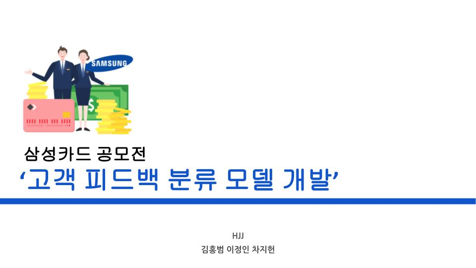

# SamsungCard_SCIC2021
[2021 삼성카드 데이터분석 공모전] 고객 피드백 NLP <1차 탈락>
 
Notion: https://www.notion.so/b831525e3fc7443da3fd3a9a4f3481bf
 
<h3>팀원: </h3>
김홍범 https://github.com/billkim418 
이정인 https://github.com/inzeong 
차지헌 https://github.com/jcha2 
 
<h3>주제: Track 1 고객 피드백 분류 모델 개발</h3>
- 상담원 및 삼성카드 서비스에 대한 만족/불만족 피드백 분류 모델 개발  
접수: 2021.7.1 ~ 7.12 
1차 기획서 제출: 2021.7.27 
2차 결과물 제출: 2021.8.19 
 
<h2>1차 기획서</h2>

